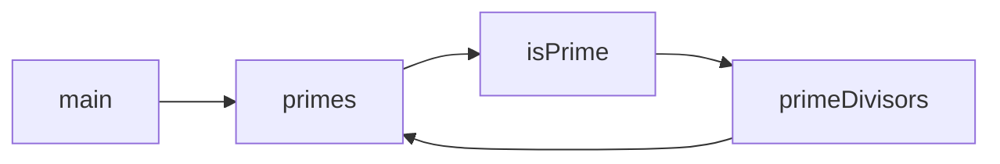

# Hello, Zettel!

Thanks to rapid advances in technology, it's never been easier to put words on the Internet.

## Features

### Maths

Prime numbers are positive integers $p > 1$ that have _exactly one_ positive divisor other than $1$.

The $n$th prime number is commonly denoted $p_n$, so $p_1 = 2$, $p_2 = 3$, and so on.

The [Dirichlet generating function] of the characteristic function of the prime numbers $p_n$ is given by

$$
\begin{aligned}
\sum^\infty_{n=1} \frac{[n \in \{p_k\}^\infty_{k=1}]}{n^{\scriptsize S}} &= \sum^\infty_{n=1} \frac{1}{p^{\scriptsize S}_n} \\
	&= \frac{1}{2^{\scriptsize S}} + \frac{1}{3^{\scriptsize S}} + \frac{1}{5^{\scriptsize S}} + \frac{1}{7^{\scriptsize S}} + \ldots \\
	&= P({\scriptsize S}),
\end{aligned}
$$

where $P({\scriptsize S})$ is the [prime zeta function] and $[{\scriptsize S}]$ is an [Iverson bracket].

[Dirichlet generating function]: https://mathworld.wolfram.com/DirichletGeneratingFunction.html
[prime zeta function]: https://mathworld.wolfram.com/PrimeZetaFunction.html
[Iverson bracket]: https://mathworld.wolfram.com/IversonBracket.html

### Code

{ data-filename="primes.hs" }
```haskell
main :: IO ()
main = mapM_ print $ take 10 primes

primes :: [Integer]
primes = 2 : 3 : filter isPrime [5,7..]

isPrime :: Integer -> Bool
isPrime = null . primeDivisors

primeDivisors :: Integer -> [Integer]
primeDivisors n = [ p | p <- takeWhile ((<=n) . (^2)) primes, n `mod` p == 0 ]
```

### Diagrams


